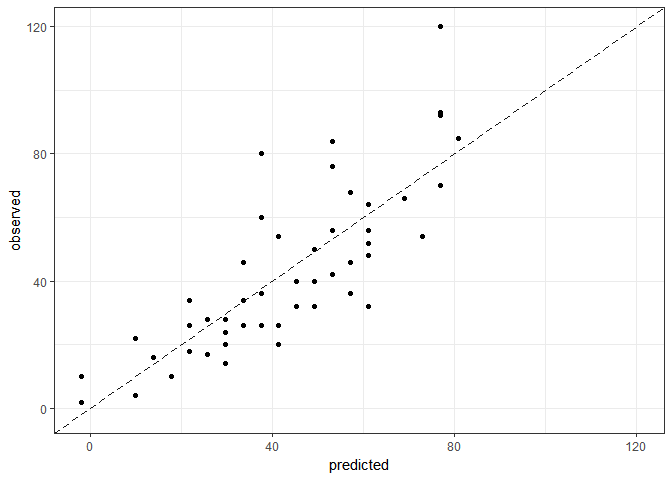
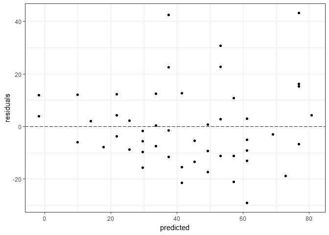

<!-- README.md is generated from README.Rmd. Please edit that file -->
regmetrics
==========

The goal of regmetrics is to provide a set of regression metrics for measuring performance in Regression Models and plots for observed, predicted values and residuals.

Example
-------

This is a basic example:

``` r
library(regmetrics)
data("cars")

# create a linear model
lm1 <- lm(dist ~ speed, data = cars)

# create vectors of observed and predicted values
y_obs <- cars$dist
y_pred <- fitted(lm1)

# compute error metrics
print(paste('R2 = ', round(r2(y_obs, y_pred),2)))
#> [1] "R2 =  0.65"
print(paste('RMSE = ', round(rmse(y_obs, y_pred),2)))
#> [1] "RMSE =  15.07"
print(paste('MAE = ', round(mae(y_obs, y_pred),2)))
#> [1] "MAE =  11.58"

# Create a plot of observed versus predicted values
plotPO(y_obs, y_pred)
```



``` r

# Create a plot of predicted versus residuals
plotPR(y_obs, y_pred)
```


